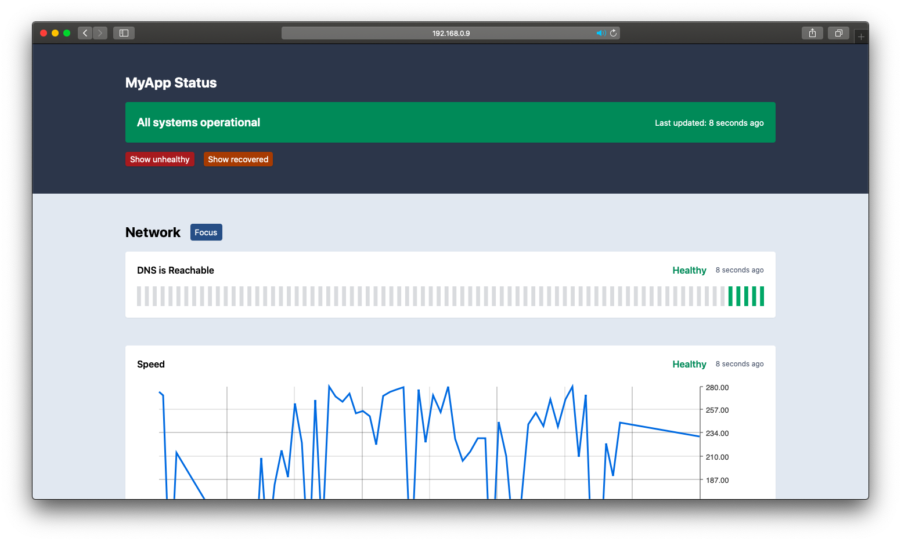

<p align="center">
  
</p>

<p align="center">Host your own uptime monitoring status pages.</p>

<p align="center">
  <a href="https://github.com/karimsa/patrol/actions">
    
  </a>
</p>

 - [TLDR](#tldr)
	- [Installing natively](#installing-natively)
	- [Running with docker](#running-with-docker)
 - [Usage](#usage)
 - [Creating a service](#creating-a-service)
 - [Creating health checks](#creating-health-checks)
	- [Health check images](#health-check-images)
	- [Health check options](#health-check-options)
 - [Managing secrets](#managing-secrets)
 - [License](#license)

## TL;DR

  1. Create a config file like [this one](https://github.com/karimsa/patrol/tree/master/example.yml).

### Installing natively

```shell
$ curl -sf https://gobinaries.com/karimsa/patrol/cmd/patrol | sh
```

### Running with docker

Image is hosted at [ghcr.io/karimsa/patrol](https://github.com/users/karimsa/packages/container/package/patrol).

```shell
$ docker run -d \
	--name patrol \
	--restart=on-failure \
	-v "$PWD:/data" \
	-p 8080:8080 \
	--log-driver json-file \
	--log-opt max-size=100m \
	ghcr.io/karimsa/patrol:latest \
	run \
	--config /config/patrol.yml
```

There are two tags that are published to the docker repo for this project:

 - `latest`: As per docker convention, this is the latest stable release of patrol.
 - `unstable`: This is the latest copy of the image from `master` - if you like to live life on the edge.

## Building docker containers from source

To build docker containers from source the following prerequistes are needed.

* [Docker](https://docs.docker.com/get-docker/)
* Git
	* Ubuntu (or Debian-based OS): `apt install git`
	* CentOS 8: `dnf install git`
	* CentOS 7: `yum install git`
* [Golang](https://golang.org/doc/install)
* Node.js/NPM
	* [Ubuntu 20.04](https://linuxize.com/post/how-to-install-node-js-on-ubuntu-20-04/)
	* [Ubuntu 18.04](https://www.digitalocean.com/community/tutorials/how-to-install-node-js-on-ubuntu-18-04)
	* [CentOS 8](https://www.digitalocean.com/community/tutorials/how-to-install-node-js-on-centos-8)
* TailwindCSS
	* `npm install tailwind`

Once those three are installed you can use the `git` command line tool to clone the repository (`git clone https://github.com/karimsa/patrol/`).

After you have cloned the repository you'll need to utilize go to compile/generate the working files from the source code. This is done by running `go generate` inside the directory where you cloned the repository. Think of `go generate` as the equivalent of `make`.

Now that we have the code compiled and the prerequistes installed you can use `docker build` to create the containers. To generate a x86_64 architecture container run `docker build .`. This will use the file named `Dockerfile` to create the image.

__If you're building ARM64v8...__

To create an image for ARM64v8 architecture you'll need to specifiy the docker file in the `docker build` command. This can be done by running `docker build -f Dockerfile-ARM64v8 .` (yes include the period!). If you do not specify that specific file, when attempting to run the container on an ARM64v8-based system such as the Raspberry PI 4, you'll receive this error: `unable to prepare context: unable to evaluate symlinks in Dockerfile path`.


## Usage

The purpose of `patrol` is to be able to self-host an automated status page that gives you an overview of
your operations. The idea is different from something like Atlassian's Statuspage, since that is more for
communicating your operation status to external stakeholders while `patrol` is more for just monitoring.

To run `patrol` on your own, you simply need access to a machine with `docker` installed. To start, you should write your own configuration file, to something like [this](example.yml).

You can then run `patrol` via docker:

```shell
$ ls
patrol.yml

$ patrol run --config /config/patrol.yml
```

This will start patrol on port `80` with the web interface. It will also give patrol access to your host machine's docker daemon so that it can spin up additional containers to run checks.

*Note: limiting the maximum log size for patrol is crucial, since patrol logs every time checks are run.*

## Creating a service

Services in patrol are simply a collection of health checks. For now, they are mostly a visual grouping - checks belonging to the same service will be grouped together on the status page. To create a new service, you simply need to add a new key-value pair to the `services` key of the configuration.

For example, a simple service assigned to 'google.ca' could have the configuration:

```yaml
services:
	google.ca:
		checks:
		- name: Delivers homepage
		  cmd: 'curl -fsSL https://www.google.ca/'
```

## Creating health checks

Health checks are the core of patrol. Each health check is a simple shell script that tests the availability of a given feature in a service. If the script executes successfully, the health check is considered to be passed. If the script exits with a non-zero exit code, the health check is considered to be failed.

A simple health check might test an HTTP server's ability to deliver content by simplying executing a `curl` request. In the example above, `curl -fsSL https://www.google.ca/` is used to simply hit the google homepage at `www.google.ca` and will fail if the content is not delivered.

Since health checks can be any shell script, it is not necessary that you only use one command. For instance, if you are testing the availability of a specific page (let's say login) and your SPA might have a 404 but the HTTP server might not return a 404, you can use `grep` to verify that the right content was received instead of 'any content was received'.

For example:

```yaml
services:
	My App:
		checks:
		- name: Delivers login
		  cmd: 'curl -fsSL https://myapp.com/login | grep MyApp'
```

**Default shell options**:

 * Patrol first tries to use the shell specified by `$SHELL` - in the provided docker image, this env var is undefined.
 * If no shell is found, patrol tries to rely on `/bin/sh`. If `/bin/sh` is symlinked to `dash` (on ubuntu systems), it will rely on `/bin/bash`.
 * The shell is started with `-e` and `-o pipefail`. This means that any failing commands in your script will result in the health check failing, and any errors in piped operations resulting in failure of the entire piped command.

Since in the above example the errors are carried forward in the pipe, and `grep` fails when it cannot find the query, this check is complete.

As you can see, layering multiple checks might help you diagnose *where* the issue is when there is an issue. In this case, having both the `Delivers homepage` and `Delivers login` checks might tell you that if the first succeeds and the second fails, there is most likely a content delivery issue as opposed to an infrastructure issue.

**Note:** Since the exit code of the health check is used to determine whether the service is running or not, it is important that your command is setup to only fail if the service is failing. In the example of a `curl` request, you must specify the `-f, --fail` flag to ensure that curl exits with a non-zero exit code if the web server does not respond with a 2XX/3XX response.

### Health check options

 - **name** (required): a string specifying the name to give this health check. If this name is changed, the entire history for the health check will be reset.
 - **cmd** (required; string/array):
	- If this is a string, it must be a command which can be passed to the shell via `/bin/sh -c 'cmd'`.
	- If this is an array, it must have all string elements and the contents will be concatenated with a ';' in between and then passed to the shell.
 - **type** ('boolean' or 'metric', defaults to boolean): if specified as 'metric', the stdout of the check's command will be parsed as a numeric value.
 - **unit** (required if type is 'metric'): if type is metric, this will be used when displaying the metric chart on the status page.

## Managing Secrets

There are two ways to manage secrets for patrol config files.

### Using environment variables

The first is to store secure values inside of environment variables. Since patrol passes its own environment variables down to the child process, any environment variables that are passed to the patrol process (via docker or otherwise) are made available to the commands.

Example:

```shell
$ cat > patrol.yml << EOF
services:
	env test:
		checks:
		- name: testing environment vars
		  cmd: 'test "$SECRET" = "hello"'
EOF

$ patrol run --config patrol.yml
# the check will always fail here

$ SECRET=hello patrol run --config patrol.yml
# the check will always pass
```

### Encrypting your config file

You can use `openssl` or [`secrets`](https://github.com/karimsa/secrets) to encrypt specific keys or the entire config file. When deploying your statuspage, remember to decrypt the keys or file so that patrol can access the raw values.

## Troubleshooting

There are a number of steps you can take to troubleshoot an installation of patrol. See the information below to get started.

### Docker

```
2021/04/02 03:32:33 Initializing with SHELL = /bin/sh
open patrol.yml: permission denied
```
* If you encounter a permission denied error for `patrol.yml` ensure that the file has at least a chmod value of 664. To fix this run `chmod 664 patrol.yml`.

```
2021/04/02 03:38:33 Initializing with SHELL = /bin/sh
open data.db: permission denied
```
* When having permission issues with `data.db` ensure that the file has at least a chmod value of 666. To fix this run `chmod 666 data.db`

```
2021/04/02 03:49:00 Initializing with SHELL = /bin/sh
open /config/patrol.yml: no such file or directory
```
* If patrol states that it cannot find your files, try removing the `/` before `config` in the `--config /config/patrol.yml` line. If this still does not work try changing `$PWD` to another directory on the system. By default Patrol will attempt to run of out whatever directory you run the docker command in. Just ensure that the files are chmodded properly and keep the `/` removed before `config` as stated above.

```
panic: listen tcp :80: bind: permission denied
```
* This error is typically seen when the `port:` variable is missing from the `patrol.yml` config. Add `port: 8080` after the `db:` variable in the config.

__Don't see your issue above?__

When submitting an issue report please make sure to gather the docker container logs. This can be done by running `docker logs CONTAINER` on your docker host. Replace `CONTAINER` with the name you gave your patrol container. If you're using the docker run command above the command will be `docker logs patrol`. Make sure to copy and provide the output in the issue report.

Please also provide your `patrol.yml` file. Make sure to sanitize it before submitting it so sensitive information isn't posted on Github. This includes but is not limited to names, addresses, phone numbers, public IP addresses (not [RFC1918](https://tools.ietf.org/html/rfc1918) or [RFC4193](https://tools.ietf.org/html/rfc4193) address space).

Last but not least, anything else that you think will help diagnose your issue please include in the report as well.


## License

Licensed under MIT license.

Copyright &copy; 2019-present Karim Alibhai.

Badge in logo created by **Artdabana@Design** from the Noun Project.
